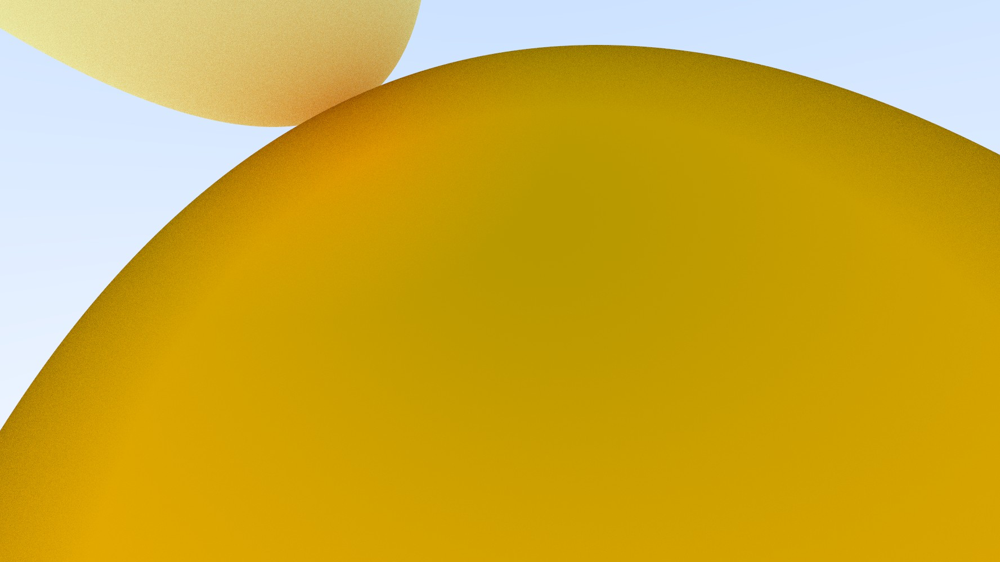

# **Interactive ray tracer**
A Winforms program for interacting with a ray tracer for rendering spheres with different materials and colors, everything written in C#
### Current features incldue:
* modifiable camera parameters
* adding/removing objects from the scenes
* changing object size, position, material, color
* rendering a preview 
* saving/loading scenes from a file
### App UI:

### Rendered images:

#
Used resources:
* [_Ray Tracing in One Weekend_](https://raytracing.github.io/books/RayTracingInOneWeekend.html)